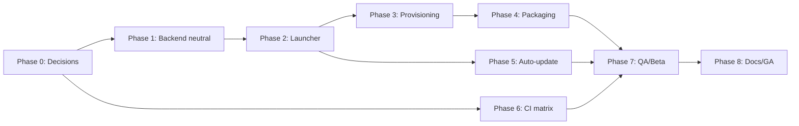

# Little Gerry — macOS & Linux Cross-Platform Port Plan

> **Status:** Tabled for future execution. This is a planning document only — no code changes have been made.
> **Created:** 2026-06-08 · **Baseline:** Build 40 / release v1.0.0 (Windows-only).
> **Owner:** TBD

---

## Purpose

Little Gerry currently ships as a Windows-only desktop app (pywebview + WebView2, FastAPI backend, PostgreSQL+pgvector in Docker, Inno Setup installer). This document captures the full plan to add **macOS** and **Linux** support without rewriting the product. Execute when prioritized.

---

## Current state (read-only audit)

### Already cross-platform — no work required
- FastAPI backend core, SQLAlchemy 2.0 async, asyncpg, Pydantic, all business logic.
- LangChain providers (Anthropic / OpenAI / Ollama).
- React 19 + Vite + TypeScript frontend.
- `docker-compose.yml` (standard Postgres + pgvector).
- `scripts/init_db.sql`.
- Most paths — use `pathlib` and `~` expansion (`storage_root = "~/.pmi-agent/documents"`, logs via `Path(__file__).parent`).

### Windows-locked — the actual porting work
| Area | File(s) | Windows-specific detail |
|---|---|---|
| Launcher GUI | `launcher.py` | `gui="winforms"` (WebView2); macOS needs `cocoa`, Linux needs `gtk` (WebKit2GTK) |
| Tray icon | `launcher.py` | `pystray` — validate NSStatusBar (mac) / AppIndicator+DBus (Linux) |
| Dialogs | `launcher.py` | `ctypes.windll.user32.MessageBoxW` is Windows-only |
| Port kill | `launcher.py` | `netstat \| findstr \| taskkill`; Unix uses `lsof -ti tcp:PORT \| xargs kill` |
| venv python | `launcher.py` | `.venv\Scripts\python.exe` vs `.venv/bin/python` |
| Docker launch | `launcher.py` | Hardcoded `C:\Program Files\Docker\Docker\Docker Desktop.exe`, `sc start com.docker.service` |
| No-window flag | `launcher.py`, `backend/services/google_service.py` | `subprocess.CREATE_NO_WINDOW` |
| Browser open | `backend/services/google_service.py` | `os.startfile` / `cmd /c start` / `rundll32`; replace with `webbrowser.open()` |
| Secrets | `backend/config.py` | `keyring` works on all three, but Linux needs a Secret Service backend or fallback |
| Provisioning | `Start/Stop/Update/Install Little Gerry.bat`, `scripts/*.ps1` | `winget`, `sc.exe`, PowerShell, Task Scheduler, Windows Firewall, registry |
| Installer | `installer/setup.iss` | Inno Setup is Windows-only |

### Cleanup noted during audit
- `frontend/src-tauri/` and the Tauri deps in `frontend/package.json` are unused (app uses pywebview). Can be removed during the port.
- `scripts/setup-llm-server.ps1`, `cleanup-ollama.ps1`, `backup-ollama-models.ps1`, `migrate-to-server.ps1`, `test-llm-server.ps1`, `build-desktop.ps1` are advanced/optional — defer porting.

---

## Phase 0 — Decisions to lock before coding

These shape everything downstream. Resolve each with a short spike if needed.

1. **Database runtime.** Docker Desktop is heavy on macOS/Linux.
   - Option A: Keep Docker everywhere (consistent; Docker Desktop license + install friction on Mac).
   - **Option B (recommended):** Pluggable `db_runtime` interface — use Docker if present, else native PostgreSQL+pgvector (Postgres.app on macOS, distro package / embedded binary on Linux).
2. **Shell strategy.** **Recommended:** replace per-OS `.bat`/`.ps1` with a single **Python orchestrator** (`launcher/platform/` package) invoked by thin per-OS entrypoints — one codebase instead of parallel bash/PowerShell.
3. **Packaging targets.** macOS: notarized `.app` → `.dmg`. Linux: **AppImage** first, `.deb` second. Decide on Apple Developer ID signing/notarization (required for smooth Mac launch).
4. **Ollama scope.** Defer the Ollama/LLM-server scripts to a later milestone (recommend out of scope for the initial port).
5. **Distribution & repo visibility.** Repo is private; releases require repo access or a public channel. Decide before invites depend on it.

**Phase 0 de-risking spikes (research only):** Linux GTK WebView + tray behavior, macOS notarization flow, embedded/native pgvector options.

---

## Phase 1 — Platform-neutral backend (low risk, do first)

Make the backend 100% OS-agnostic so it runs identically once any launcher starts it.

- **Sprint 1.1 — Browser & subprocess:** replace `os.startfile`/`cmd`/`rundll32` chain in `google_service.py` with `webbrowser.open()`; add a `no_window_kwargs()` helper returning `CREATE_NO_WINDOW` on Windows and `{}` elsewhere, used at every subprocess call.
- **Sprint 1.2 — Secrets backend:** verify `keyring` on macOS Keychain and Linux; add documented Linux fallback (`keyrings.alt` encrypted file or `pass`) + startup self-check with graceful guidance.
- **Sprint 1.3 — Path/asset audit:** confirm storage/logs/uploads resolve via `pathlib` on all OSes; remove any latent backslash/`%VAR%` assumptions.

**Deliverable:** backend passes `pytest` on all three OSes with no platform branches outside the helpers above.

---

## Phase 2 — Cross-platform launcher

Refactor `launcher.py` into a platform-aware shell without changing UX.

- **Sprint 2.1 — OS abstraction layer:** `launcher/platform/{windows,macos,linux}.py` implementing one interface: `webview_gui()`, `start_docker()`/`ensure_db()`, `kill_port()`, `venv_python()`, `confirm_dialog()`, `tray_icon()`.
- **Sprint 2.2 — GUI + tray:** `winforms` → `cocoa`/`gtk`; replace `MessageBoxW` with a pywebview/Tk dialog; validate `pystray` on mac/Linux (Linux may need `dbus-python`).
- **Sprint 2.3 — Process & DB control:** cross-platform `kill_port`; `start_docker`/`ensure_db` per the Phase 0 DB decision.

**Deliverable:** `python launcher.py` brings up the full window + tray on each OS from a dev checkout.

---

## Phase 3 — Provisioning & runtime orchestration

Replace `.bat`/`.ps1` with the Python orchestrator + thin entrypoints.

- **Sprint 3.1 — First-run setup in Python:** port `install.ps1` logic (install Python/Node/Docker, `uv sync`, `npm install`, migrations) into `platform/provision.py` with per-OS managers: `winget` (Win), `brew` (mac), `apt`/`dnf`/AppImage-bundled (Linux).
- **Sprint 3.2 — Lifecycle entrypoints:** macOS `.app` launch script → `launcher.py`; Linux AppImage `AppRun` / `littlegerry` shim; keep Windows `.bat` unchanged so the shipping build doesn't break.

**Deliverable:** clean-machine first run succeeds on macOS and Ubuntu LTS.

---

## Phase 4 — Packaging & installers

- **Sprint 4.1 — macOS:** build `.app` (py2app or PyInstaller) → `.dmg` via `create-dmg`; codesign + notarize (Developer ID); add the "install succeeded" UX.
- **Sprint 4.2 — Linux:** AppImage (primary) bundling Python runtime + app; `.desktop` entry + icon; optional `.deb` after.
- **Sprint 4.3 — Installer parity:** mirror Windows installer behaviors (shortcut/menu entry, success message, first-run hand-off).

**Deliverable:** downloadable `LittleGerry.dmg` and `LittleGerry-x86_64.AppImage`.

---

## Phase 5 — Cross-platform auto-update

- Generalize `_auto_update()` (git path) and the in-app updater so the dirty-tree guard, `uv sync`, `npm install`, and `alembic upgrade head` run via the Phase 2 abstraction.
- For packaged apps, choose update channel: git-based (current) vs release-asset replacement (Sparkle on mac / AppImageUpdate on Linux). **Recommend release-asset updates** for packaged builds.

---

## Phase 6 — CI/CD (parallelize with Phase 1+)

- GitHub Actions matrix: `windows-latest`, `macos-latest`, `ubuntu-latest`.
- Every push: lint + `pytest` + `tsc`/build.
- On tag: build & attach all three installers to the GitHub Release automatically (replaces manual `gh release create`).

---

## Phase 7 — QA & beta

- Test matrix: Win10/11, macOS (Apple Silicon + Intel), Ubuntu LTS (+ one Fedora).
- Verify: first-run setup, Google SSO browser flow, tray actions, DB lifecycle, auto-update, invite email, keyring.
- Internal beta per OS; fix platform bugs.

---

## Phase 8 — Docs & GA

- Per-OS install sections in `README.md` / `USER_GUIDE.md`.
- Update `DEVELOPER_GUIDE.md` with the platform abstraction.
- Cut a unified cross-platform release (e.g. v1.1.0).

---

## Sequencing & dependencies

- **Risk hotspots:** Linux GTK WebView + tray (WebKit2GTK quirks), macOS notarization, Docker-vs-native-Postgres. Spike each in Phase 0.
- **Lowest-hanging fruit (safe early wins):** all of Phase 1, plus the `venv_python()` and `kill_port()` abstractions — small, isolated, and they unblock everything else.

---

## Definition of done

- A user on Windows, macOS, or Linux can download an installer, run first-time setup, sign in with Google SSO, and use every feature with parity.
- One launcher codebase with a thin per-OS abstraction; no duplicated shell scripts.
- CI builds and publishes all three installers on tag.
- Docs cover all three platforms.
